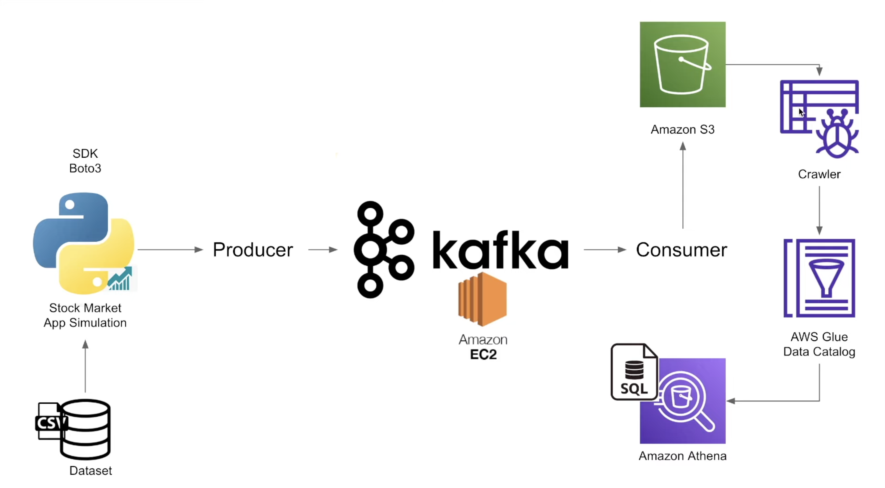

# StockStreamX

## Introduction

StockStreamX is a project that builds a data pipeline to ingest stock market data from a data source, store it in a data lake, and make it available for analysis.

## Project Architecture

Project's architecture in the image below:

## Technologies in Action

These are the technologies used:

- Python
- AWS S3
- AWS Athena
- AWS Glue Catalog
- AWS Glue Crawler
- AWS EC2
- Apache Kafka
